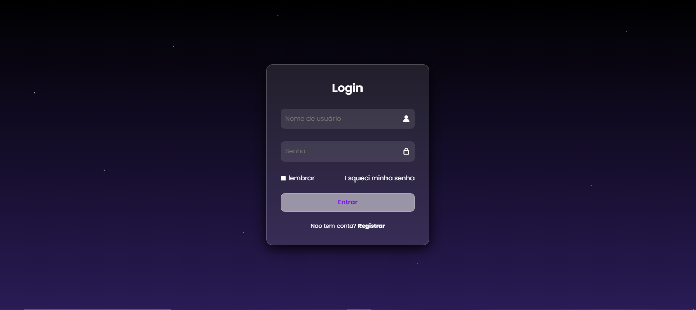

# 🔐 Tela de Login com Glassmorphism

Este projeto é uma **Tela de Login moderna**, criada com **HTML e CSS**, aplicando o efeito **Glassmorphism** e um fundo com estrelas para deixar a interface mais atraente.

---

## 🚀 Tecnologias utilizadas
- **HTML5**
- **CSS3**

---

## ✨ Funcionalidades
- Layout estilizado com efeito **Glassmorphism**.
- Fundo com **efeito de estrelas** para um design único.
- Formulário de login com:
  - Campo de usuário
  - Campo de senha
  - Checkbox "lembrar"
  - Link para recuperação de senha
  - Link para registro de novo usuário
- Botão de **login interativo**.

---

## 🎨 Demonstração
🔗 [Acesse o projeto online](https://login-screen-jb.netlify.app/)

---

## 📸 Preview

---

## 📌 Observações
Este projeto foi desenvolvido para **prática de front-end** e não é funcional em termos de autenticação.  
Pode ser adaptado e integrado a sistemas reais de login.  

---
